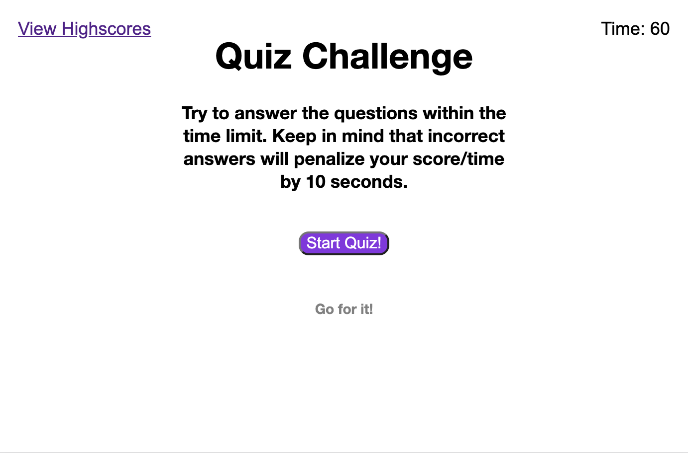
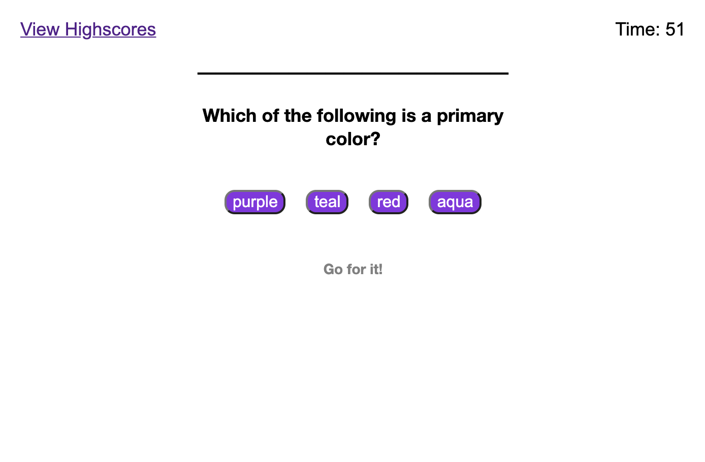
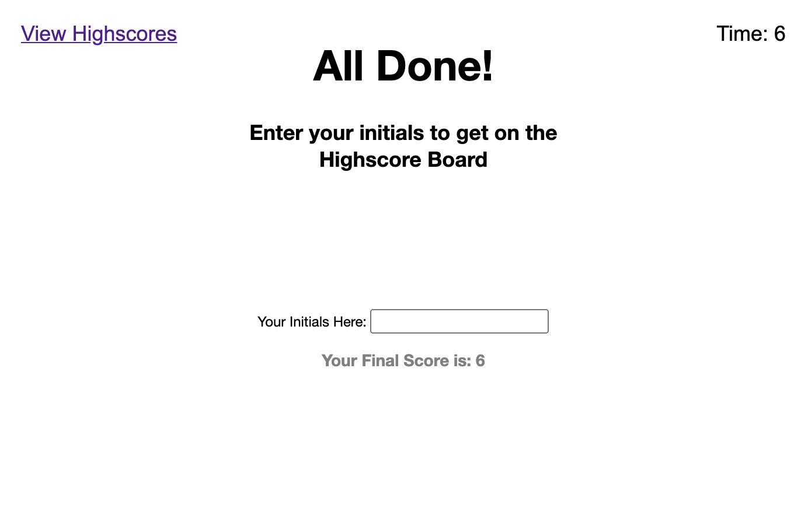

# Quiz Challenge

This site is a simple multiple choice quiz about colors.  I'm afraid that at the moment the work is incomplete as I am having difficulty with debugging the js file. aroud the local storage functions.  I am seeing multiple errors that I cannot account for in the time allotted.

---------
## Built With

* [HTML](https://developer.mozilla.org/en-US/docs/Web/HTML)
* [CSS](https://developer.mozilla.org/en-US/docs/Web/CSS)
* [Javascript](https://developer.mozilla.org/en-US/docs/Web/JavaScript)
* [Git](https://git-scm.com/)
* [GitHub](https://github.com/)

-----
## Code Snippets

**right answer function**
```js
     function rightAnswer() {
        ++currentQuestionID;
        if (currentQuestionID < quizContent.length) {
        currentQuestion(currentQuestionID);
        rightWrong.textContent = "Right!"
        } else { allDone(); }
        };            
```

**Timer Code**
```js
    var countDown = document.querySelector("#countdown");
    var secondsLeft = 60;
    var finalScore;
    countDown.textContent = "Time: " + secondsLeft;
    function startTimer() {
        timerInterval = setInterval(function () {
            secondsLeft--;
            if (secondsLeft <= 0) {
                secondsLeft = 0;
                clearInterval(timerInterval);
                allDone();
            }
            countDown.textContent = "Time: " + secondsLeft;
            }, 1000);
    }
```
**Quiz "Engine"**
```js
function currentQuestion(q) {
    quizQInstr.textContent = (quizContent[q].Question);
    document.querySelector("#button-rows").innerHTML = "";
    for (var i = 0; i < quizContent[q].Answers.length; i++) {
        var answerBtn = document.createElement("BUTTON");
        answerBtn.textContent = quizContent[q].Answers[i];
        if (quizContent[q].RightAnswer === quizContent[q].Answers[i]) {
            answerBtn.addEventListener("click", rightAnswer);
        } else {
            answerBtn.addEventListener("click", wrongAnswer);
        }
        document.querySelector("#button-rows").appendChild(answerBtn);
    }
};
```
---
### Deployed Link

* [See Live Site]()
---
### On GitHub

* [Repository Link]()

---
## Screenshots:

### Opening Screen

### Question

### Final Screen



---
### Author: *Robert Schramm*
- [LinkedIn](https://www.linkedin.com/in/robertwschramm/)
- [Link to Github](https://github.com/rbrtpublic1)
---
### License
This project is licensed under the MIT License

---

### Acknowledgments

* Thank you to M.N. for the multi-hour consultation!
